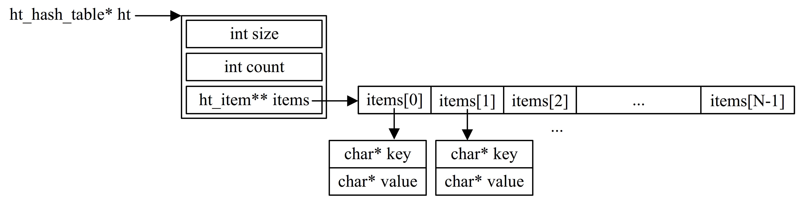

# Write a hash table in C

Thanks for James Routley's tutorial, https://github.com/jamesroutley/write-a-hash-table. This tutorial describes each component of hash table in great detail. The total number of implement code is not much, but it teaches me a lot. 

I read all seven chapters and write the program at the same time, but I don't find the attachment of complete code. Also, I find a few issues in program after finishing the tutorial (The same problem is discussed in the "Issues" area, the author gives an answer). I think it would be better to provide a complete project code, that's why I commit my project code here. 

On the other side, I would like to give a brief introduction of this project, i.e. hash table. Personally, it is a summary of knowledge and project development. 

It can be roughly divided into three components: 

- Construction of hash table. 
- Insert, search and delete methods. 
- Resizing of hash table. 

## Construction of Hash table
From a code-level perspective, a hash table can be defined as a struct which contains a second rank pointer variable and two integer variables, as shown in the picture below.



- When building a hash table, we allocate N consecutive blocks of memory from the heap, where N denotes the number of elements contained in the hash table and is determined by HT_INITIAL_SIZE. Each element, also called "bucket", is exactly a pointer that points to a key-value struct variable (also allocated from heap). 
- The integer variable (size) records how many "buckets" the hash table contains, usually is a prime. 
- Each operation of insert and delete changes the number of valid elements the hash table contains. Thus, the integer variable (count) is used to track it. Moreover, in order to realize Resizing, the integer variable (count) is a must. 
  
## Insert, search and delete methods
All operations on a hash table must calculate a hash value based on the key at first. The hash function selected is extremely important since **uneven function can lead to frequent collision events**. The author, in this tutorial, adopts the hash function as below. However, collision events cannot be eliminated; they should be avoided as far as possible. Therefore, another important thing is **addressing the collision events**. The author, in this tutorial, adopts double hashing. It utilizes the second hash function to modify the result of the first hash function. The more collisions there are, the greater weight of hash_b (the result of the second function) will have. 
```
int ht_hash(const char* str, const int prime, const int num_buckets) {
    long hash = 0;
    const int len_str = strlen(str);
    for (size_t i = 0; i < len_str; i++) {
        hash += (long)pow(prime, len_str - (i+1)) * str[i];
        hash = hash % num_buckets;
    }
    return (int)hash;
}
```

Insert, search and delete methods are defined as below:
```
void ht_insert(ht_hash_table* ht, const char* key, const char* value);
char* ht_search(ht_hash_table* ht, const char* key);
void ht_delete(ht_hash_table* h, const char* key);
```
1. insert
   
    First, a new item waiting to insert is constructed. Then calculating a hash value (index) through the hash function, the element in items[index] is picked out. If it is empty (NULL), the new item is inserted at this "bucket". Otherwise, we need to compare items[index]->key with item->key. If they are equal, we cover it. If not, collision happens, we re-hashing to get the next index and repeat the same comparison procedure. 

2. search
    
    We get the hash value (index) through the hash function. If it is empty (NULL), the key-value that we are looking for is not stored in this hash table. Otherwise, we need to compare items[index]->key with the given key. If they are equal, we return items[index]->value. If not, collision happens, we re-hashing to get the next index and repeat the same comparison procedure. 

3. delete

    Delete method is similar to the search method. If we find an item that we are looking for, we delete it (free the memory it occupied). It should be note that we cannot assign NULL to items[index] since the reason illustrated in chapter 5.
    > The item we wish to delete may be part of a collision chain. Removing it from the table will break that chain, and will make finding items in the tail of the chain impossible. 

    Thus, items[index] is set to a pointer which points to a specific struct variable (In insert method, we "jump over" such pointer). It is also for this reason, the hash table will contain more and more such "unusual pointers" when more and more delete method get performed. **Personally, I think it is a potential issue**. Surely, resize the hash table can somewhat alleviate this issue. 

## Resizing of hash table. 
Before each insert or delete operation is performed, we check load of hash table (load =  number of valid items / total number of buckets). If the load exceeds or falls below a pre-defined threshold, we resize the hash table. We construct a new hash table with twice or half size and only copy valid items from the old one. Then swap two pointers. The new hash table that contains old memory is deleted. 

Drawing is awkward, thank you for your patience. 